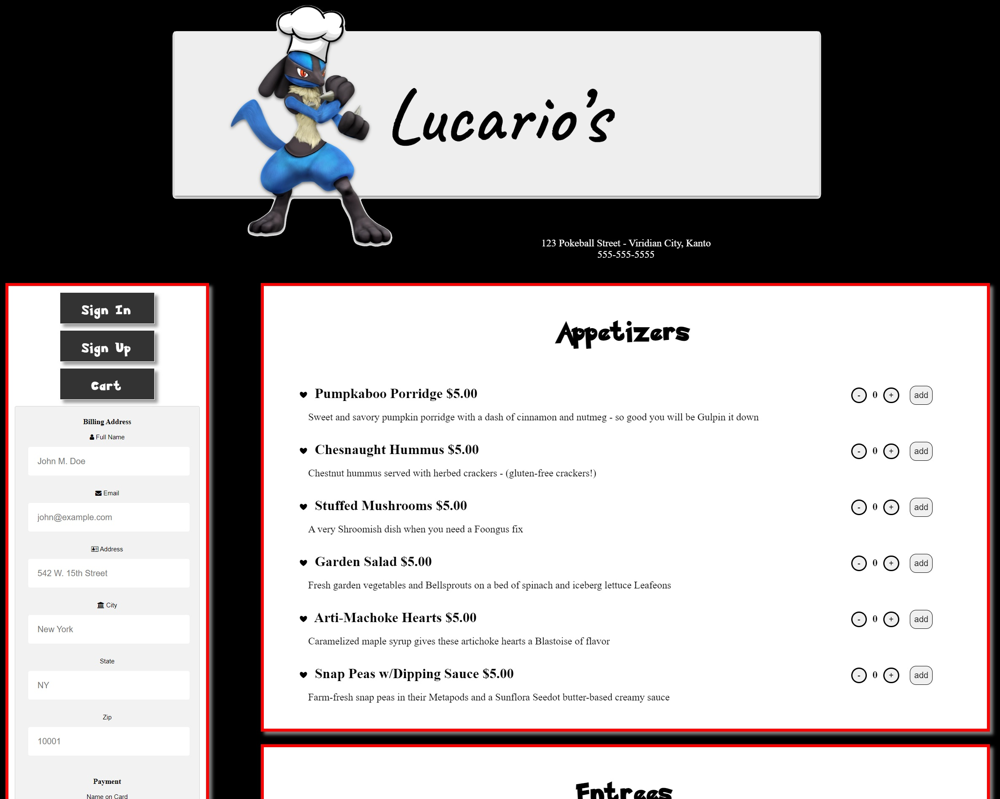

## Table of contents
*[Introduction](#introduction)  
*[Technologies](#technologies-used)  
*[Usage](#usage)  
*[Deployment](#deployment)  
*[Screenshots](#screenshots)  
*[Future](#future-implementations)  
*[Credits](#credits)  
*[Contact](#contact)  
*[License](#license)  

## Introduction
 
 Lucario's web app allows users to view the restaurant's menu, log-in to store personal information such as phone number, address, credit card information, and favorited dishes. This app makes it easier to order food, pay, and leave customization notes for Lucario's via mobile or desktop. Utilizing dynamically responsive layouts and comprehensive functionality, the app provides a convenient method for restaurant-customer interactions, even on the go.
  
  

 ## Technologies Used

 HTML 5 |
 CSS |
 Javascript |
 [HandleBars](https://handlebarsjs.com/guide/builtin-helpers.html#each) |
 [Node](https://nodejs.org/en/) |
 [Express](https://expressjs.com/) |
 [MySql](https://www.mysql.com/) |
 [nodemon](https://www.npmjs.com/package/nodemon) |
 [Heroku](https://www.heroku.com/home) |
 [Insomnia](https://insomnia.rest/products/insomnia) |
 [Helmet](https://www.npmjs.com/package/helmet) |
  
  

 ## Usage

 To use this application, customers simply visit the website! They can see the menu and prices, address, and phone number of Lucario's right on the homepage. By clicking on "Sign In or "Sign Up" customers can also make orders directly through the site. Being signed in also provides the customers with the ability to review dishes, add them to their favorites, and even store their personal information to make future checkout and delivery requests much more quick and easy.

 For the owners of Lucario's they must open the app using their integrated terminal in a program such as VS Code. After initializing by typing `npm i` the owners can access the back-end of the application where they can alter menus, prices, hours of operation, users, and more.
  
  

 ## Deployment

 -[Live](https://xyz-restaurant.herokuapp.com/)  
 -[Github](https://github.com/dannyjunlee/restaurant-menu)
  
  

## Screenshots

## Future Implementations

The future of this app includes but is not limited to incorporation of geo-location abilities to allow customers to get up-to-date directions and eventually see how far away their delivery driver is. The application will also be able to alert customers when their orders have been received by Lucario's, when the order is done being prepared, and when the order is ready for pick-up.
 
 

## Credits

[Igor-Korman](https://github.com/ikorman12)  
[Daniel-Jun-Lee](https://github.com/dannyjunlee)  
[Daniel-Keller](https://github.com/DBanfieldKeller)  
[Kevin-Chen](https://github.com/realkevinC)  
[Jackson-Impellizeri](https://github.com/jaxpi)
 
 

## Contact

Feel Free to contact us through our github links above.
 
 

## License

MIT License

Copyright (c) 2022 group 4

Permission is hereby granted, free of charge, to any person obtaining a copy
of this software and associated documentation files (the "Software"), to deal
in the Software without restriction, including without limitation the rights
to use, copy, modify, merge, publish, distribute, sublicense, and/or sell
copies of the Software, and to permit persons to whom the Software is
furnished to do so, subject to the following conditions:

The above copyright notice and this permission notice shall be included in all
copies or substantial portions of the Software.

THE SOFTWARE IS PROVIDED "AS IS", WITHOUT WARRANTY OF ANY KIND, EXPRESS OR
IMPLIED, INCLUDING BUT NOT LIMITED TO THE WARRANTIES OF MERCHANTABILITY,
FITNESS FOR A PARTICULAR PURPOSE AND NONINFRINGEMENT. IN NO EVENT SHALL THE
AUTHORS OR COPYRIGHT HOLDERS BE LIABLE FOR ANY CLAIM, DAMAGES OR OTHER
LIABILITY, WHETHER IN AN ACTION OF CONTRACT, TORT OR OTHERWISE, ARISING FROM,
OUT OF OR IN CONNECTION WITH THE SOFTWARE OR THE USE OR OTHER DEALINGS IN THE
SOFTWARE.
